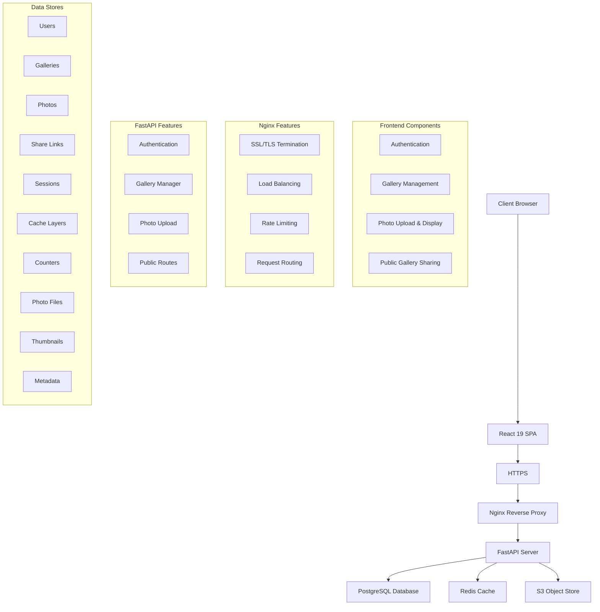
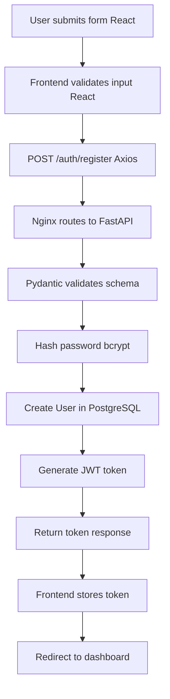
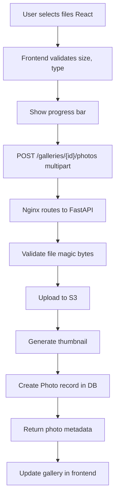
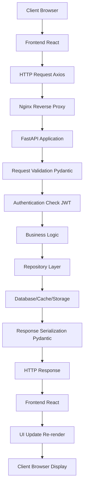
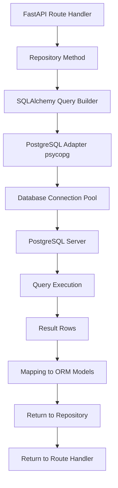
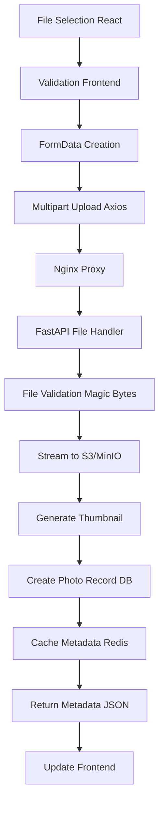

# System Architecture

## Overview

Viewport is a full-stack photo portfolio sharing platform with a React frontend, FastAPI backend, and PostgreSQL database. The system is designed for scalability, security, and ease of deployment.

## Architecture Diagram



## Layered Architecture

### 1. **Presentation Layer** (Frontend - React)
- User interface
- Form handling and validation
- Client-side routing
- State management (Zustand)
- HTTP client (Axios)

### 2. **API Gateway Layer** (Nginx)
- HTTPS termination
- Request routing
- Load balancing
- Rate limiting
- Static file serving

### 3. **Application Layer** (FastAPI)
- HTTP request handling
- Business logic
- Request validation (Pydantic)
- Error handling
- Authentication/Authorization

### 4. **Service Layer**
- File operations (S3/MinIO)
- Image processing
- Caching logic
- Task queuing
- Metrics collection

### 5. **Data Access Layer** (Repository Pattern)
- Database queries
- ORM abstraction
- Data transformation

### 6. **Persistence Layer**
- PostgreSQL database
- Redis cache
- S3/MinIO storage

## Component Interaction Flow

## Component Interaction Flow

### User Registration



### Photo Upload


## Technology Stack

### Frontend
| Technology   | Purpose                 |
| ------------ | ----------------------- |
| React 19     | UI framework            |
| TypeScript   | Type safety             |
| Vite         | Build tool & dev server |
| React Router | Client-side routing     |
| Zustand      | State management        |
| Axios        | HTTP client             |
| Tailwind CSS | Styling                 |
| Vitest       | Testing framework       |

### Backend
| Technology  | Purpose              |
| ----------- | -------------------- |
| Python 3.13 | Programming language |
| FastAPI     | Web framework        |
| SQLAlchemy  | ORM                  |
| Pydantic    | Data validation      |
| Alembic     | Database migrations  |
| PyJWT       | JWT authentication   |
| Bcrypt      | Password hashing     |
| Boto3       | S3 client            |
| Pillow      | Image processing     |

### Infrastructure
| Technology     | Purpose             |
| -------------- | ------------------- |
| PostgreSQL     | Primary database    |
| Redis          | Cache & sessions    |
| S3             | Object storage      |
| Docker         | Containerization    |
| Nginx          | Reverse proxy       |
| Prometheus     | Metrics (optional)  |
| Docker Compose | Local orchestration |

## Data Flow

### 1. **API Request Flow**


### 2. **Database Query Flow**


### 3. **File Upload Flow**


## Security Architecture

### Authentication Layer
- JWT tokens (30 min expiry)
- Refresh tokens (7 day expiry)
- Secure HTTP-only cookies
- Password hashing with bcrypt (rounds: 12)

### Authorization Layer
- Role-based access control (owner checks)
- Resource ownership verification
- Public/private endpoint distinction

### Transport Security
- HTTPS/TLS encryption
- CORS policy enforcement
- Rate limiting
- Request validation

### Data Protection
- File type validation (magic bytes)
- Input sanitization (Pydantic)
- SQL injection prevention (ORM)
- CSRF token handling

## Scalability Considerations

### Horizontal Scaling
- Stateless FastAPI instances
- Load balancing via Nginx
- Shared database connection pool
- Centralized cache (Redis)
- Object storage (S3)

### Vertical Scaling
- Database optimization (indexes, queries)
- Connection pooling
- Caching strategies
- Image optimization

### Performance Optimizations
- CDN for static assets
- Image thumbnails and caching
- Lazy loading on frontend
- Database query optimization
- Async operations (Celery)

## Deployment Models

### Development
```
docker-compose up
- Single machine
- All services in containers
- MinIO for local S3
- PostgreSQL in Docker
- Redis in Docker
```

### Production
```
Kubernetes / Cloud Platform
- Load balancer / API Gateway
- FastAPI application
- Managed PostgreSQL (RDS)
- Managed Redis (ElastiCache)
- AWS S3 or equivalent
- CloudFront CDN
- Application monitoring
- Log aggregation
```

## Error Handling Strategy

### Backend Errors
1. Validate input (Pydantic)
2. Check authorization
3. Execute business logic
4. Catch exceptions
5. Log error (with context)
6. Return HTTP error response

### Frontend Error Handling
1. Check HTTP status
2. Parse error message
3. Display to user (Toast)
4. Log to console/monitoring
5. Offer recovery action

## Monitoring & Observability

### Metrics
- Request count & latency
- Error rates
- Database query performance
- Cache hit ratio
- File upload size/duration

### Logging
- Application logs (structured JSON)
- Access logs (Nginx)
- Database query logs
- Error traces with context

### Health Checks
- Application health endpoint
- Database connectivity
- Cache availability
- S3 connectivity

## Deployment Pipeline

```
Code Push (Git)
    ↓
GitHub Actions Trigger
    ↓
Run Tests
    ↓
Lint & Format Check
    ↓
Build Docker Images
    ↓
Push to Registry
    ↓
Deploy to Staging
    ↓
Run Integration Tests
    ↓
Manual Approval
    ↓
Deploy to Production
    ↓
Monitor & Alert
```

## Related Documentation

- [Backend Documentation](./backend/README.md)
- [Frontend Documentation](./frontend/README.md)
- [API Reference](./api/README.md)
- [Deployment Guide](./deployment/README.md)
- [Development Guide](./development/README.md)

---

For implementation details, see the specific architecture files in subdirectories.
