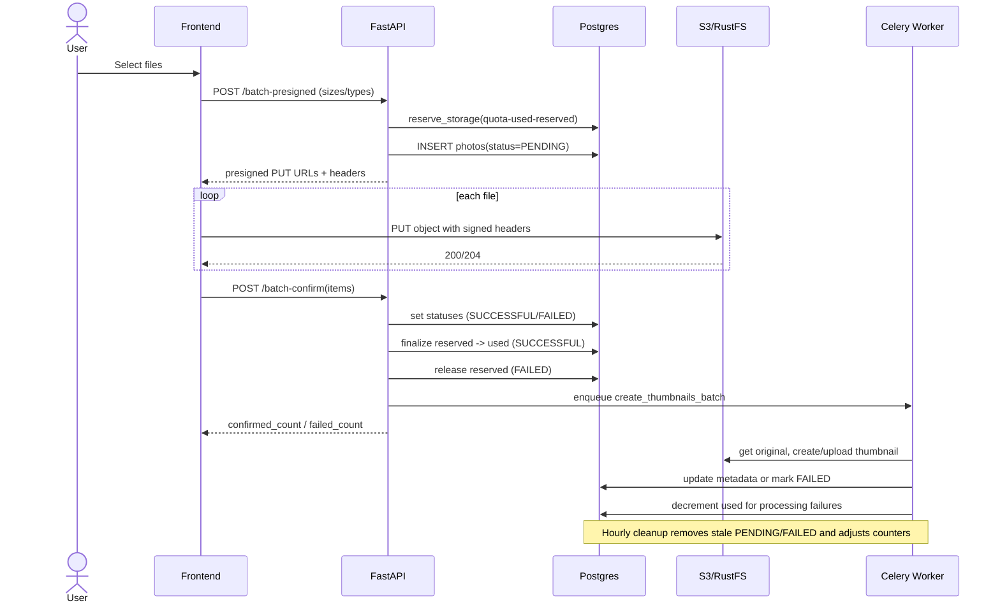

# Storage Quotas & Upload Accounting

This document describes how storage quotas are enforced in the backend, how upload bytes move between counters, and how Celery tasks keep data consistent.

## Scope

Relevant backend modules:

- `src/viewport/api/photo.py`
- `src/viewport/repositories/user_repository.py`
- `src/viewport/repositories/gallery_repository.py`
- `src/viewport/background_tasks.py`
- `src/viewport/models/user.py`
- `src/viewport/models/gallery.py`

## Data Model

User storage fields (`users` table):

- `storage_quota` — hard limit in bytes
- `storage_used` — bytes of finalized successful uploads
- `storage_reserved` — bytes reserved for `PENDING` uploads

Photo upload status (`photos.status`):

- `PENDING` (`1`) — presigned URL issued, upload expected
- `SUCCESSFUL` (`2`) — upload confirmed and accepted for processing
- `FAILED` (`3`) — upload rejected or processing failed

## Quota Formula

Available bytes are computed as:

$$
available = storage\_quota - storage\_used - storage\_reserved
$$

Reservation is accepted only if `bytes_to_reserve <= available`.

## Upload Lifecycle

### 1) Reserve quota + issue presigned URLs

Endpoint: `POST /galleries/{gallery_id}/photos/batch-presigned`

Flow:

1. Validate gallery ownership.
2. Filter files by backend max size (`MAX_FILE_SIZE`).
3. Sum valid file sizes and call `UserRepository.reserve_storage(...)`.
4. Create `Photo` rows with `PENDING` status.
5. Return presigned PUT URL + signed headers per file.

Counter impact:

- `storage_reserved += sum(valid_file_sizes)`
- `storage_used` unchanged

### 2) Confirm uploads

Endpoint: `POST /galleries/{gallery_id}/photos/batch-confirm`

Flow:

1. Validate gallery ownership and fetch photo rows.
2. For each item:
   - `success=true` -> photo status moves to `SUCCESSFUL`.
   - `success=false` -> photo status moves to `FAILED`.
3. Apply byte transitions:
   - Successful bytes -> `finalize_reserved_storage`.
   - Failed bytes from `PENDING` -> `release_reserved_storage`.
4. Queue thumbnail generation task.

Counter impact:

- Successful confirm: `storage_reserved -= bytes`, `storage_used += bytes`
- Failed confirm: `storage_reserved -= bytes`

### 3) Background processing

Task: `create_thumbnails_batch_task`

Key behavior:

- Downloads original object from S3.
- Validates image bytes.
- Generates and uploads thumbnail.
- Writes `thumbnail_object_key`, width, height.
- Marks processing failures as `FAILED` and decrements `storage_used` for those photo IDs.

### 4) Cleanup of stale records

Task: `cleanup_orphaned_uploads_task` (hourly)

Purpose:

- Deletes stale `PENDING` (and currently also `FAILED`) photo records older than threshold.
- Deletes corresponding S3 objects.
- Releases reserved bytes for deleted records.

### 5) Gallery delete path

API soft-deletes gallery, then Celery task `delete_gallery_data_task`:

- Deletes all S3 objects under `gallery_id/` prefix.
- Hard-deletes gallery rows (`photos`, `share_links`, `gallery`).
- Decrements owner counters (`storage_used` for successful, `storage_reserved` for pending bytes).

## Sequence Diagram (Mermaid)

## PlantUML Diagram

See [quota_flow_sequence.puml](./quota_flow_sequence.puml).

## Counter Transition Table

| Event                        | Photo status before | Photo status after | `storage_reserved` | `storage_used` |
| ---------------------------- | ------------------- | ------------------ | ------------------ | -------------- |
| Presigned issued             | —                   | `PENDING`          | `+file_size`       | no change      |
| Confirm success              | `PENDING`           | `SUCCESSFUL`       | `-file_size`       | `+file_size`   |
| Confirm fail                 | `PENDING`           | `FAILED`           | `-file_size`       | no change      |
| Delete photo                 | `PENDING`           | deleted            | `-file_size`       | no change      |
| Delete photo                 | `SUCCESSFUL`        | deleted            | no change          | `-file_size`   |
| Thumbnail processing failure | `SUCCESSFUL`        | `FAILED`           | no change          | `-file_size`   |

## Operational Notes

- Counters are updated with row locking (`SELECT ... FOR UPDATE`) in `UserRepository` methods.
- Reconciliation helper exists: `UserRepository.recalculate_storage(user_id)` to rebuild counters from DB state.
- Presigned URLs are short-lived and include signed headers for content type/length/tagging.

## Suggested Hardening (Recommended)

1. In cleanup, release reserved bytes only for stale `PENDING` records, not all stale failed records.
2. Make status transition + quota transition atomic (single transaction boundary) for confirm path.
3. Add integration tests for quota idempotency and stale failed cleanup accounting.
